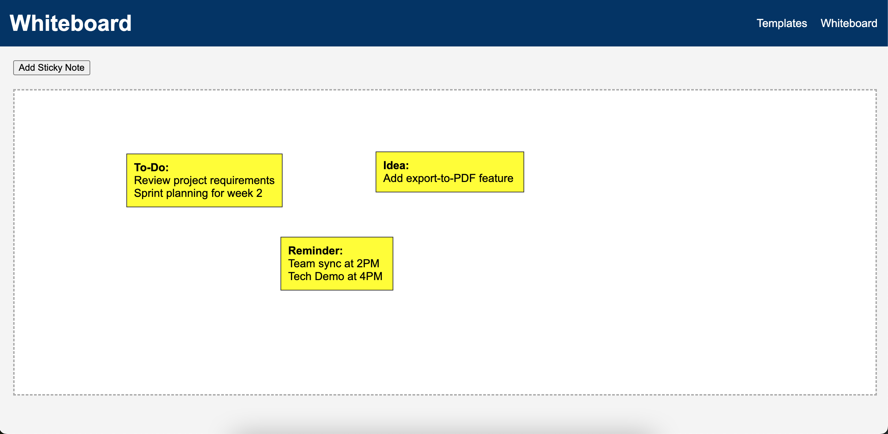

# Digital Engagement Toolkit  

An interactive web-based toolkit for digital collaboration and engagement.  
This project showcases front-end engineering and design skills by providing a lightweight **whiteboard app** with draggable sticky notes, reusable templates, and a simple UI that mimics enterprise collaboration tools.  

👉 **Live Demo:** [Link](https://vinny990.github.io/digital-engagement-toolkit/whiteboard.html)
👉 **GitHub Repo:** [vinny990/digital-engagement-toolkit](https://github.com/vinny990/digital-engagement-toolkit)  

---

## Screenshot




---

## 🚀 Features  
- 📝 **Interactive Whiteboard** – create, drag, and delete sticky notes.  
- 🎨 **Reusable Templates** – styled components that simulate enterprise-ready engagement tools.  
- ⚡ **Vanilla JS Logic** – no heavy frameworks, just pure HTML, CSS, and JavaScript.  
- 💾 **Persistent Notes** – notes remain even after refreshing (localStorage).  
- 🔗 **Inspired by Platforms** – designed to resemble tools like **Alleo, Mural, and Microsoft Whiteboard**.  

---

## 📂 File Structure  

```
digital-engagement-toolkit/
├── index.html        # Landing page with navigation
├── whiteboard.html   # Interactive whiteboard app
├── style.css         # Styling and layout
├── script.js         # Whiteboard logic
└── README.md         # Project documentation
```

---

## 🛠 How to Run Locally  

1. Clone this repo:  
   ```bash
   git clone https://github.com/vinny990/digital-engagement-toolkit.git
   cd digital-engagement-toolkit
   ```  

2. Open `index.html` or `whiteboard.html` in your browser.  
   (No server required — runs as a static site).  

---

## 📈 Why This Project  

This toolkit demonstrates:  
- Building **intuitive user interfaces** for digital collaboration.  
- Applying **design thinking principles** with templates and reusable components.  
- Creating **lightweight, scalable front-end assets** that could integrate with larger enterprise systems.  

It was built as part of my ongoing learning and portfolio to align with roles requiring **.NET/JS development, cloud deployment, and user-facing digital engagement solutions**.  
